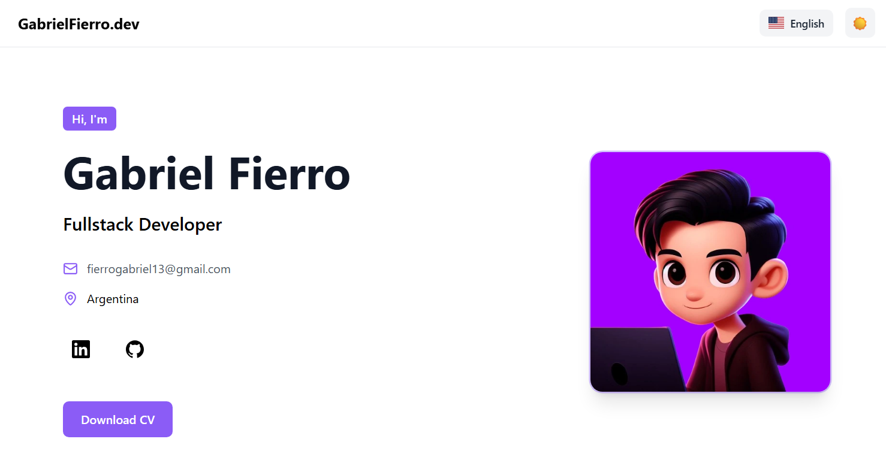

# 🚀 Gabriel Fierro — Portfolio

Personal portfolio built with **Nuxt 3**, showcasing my projects, experience, and tech stack as a **Fullstack Developer**.

🌐 **Live Demo:** https://gabrielfierro.netlify.app/

---

## ✨ Features

- 🌍 Internationalization (EN / ES)
- 🎨 Dark mode
- ⚡ Modern animations with Motion
- 📱 Fully responsive design
- 🧠 SEO optimized
- 🖼 Project previews
- 🧩 Modular component architecture

---

## 🛠 Tech Stack

- **Framework:** Nuxt 3
- **Language:** TypeScript
- **Styling:** Tailwind CSS
- **Animations:** Motion
- **Icons:** Nuxt Icon + Lucide
- **Internationalization:** @nuxtjs/i18n
- **SEO:** @nuxtjs/seo

---

## 📦 Installation

Clone the repository and install dependencies:

```bash
git clone https://github.com/yourusername/portfolio-nuxt.git
cd portfolio-nuxt
npm install
```

---

## 💻 Development

Run the development server:

```bash
npm run dev
```

The app will be available at:

```
http://localhost:3000
```

---

## 🏗 Build for Production

Create an optimized production build:

```bash
npm run build
```

Preview the production build locally:

```bash
npm run preview
```

---

## 📂 Project Structure

```
components/
content/
locales/
pages/
public/
```

- **components** → UI components
- **content** → projects and experience data
- **locales** → translations
- **pages** → Nuxt pages
- **public** → static assets

---

## 📸 Preview



---

## 📬 Contact

- GitHub: https://github.com/GabrielFierro
- LinkedIn: https://linkedin.com/in/gabriel-fierro-2020
- Email: [fierrogabriel13@gmail.com](mailto:fierrogabriel13@gmail.com)

---

⭐ If you like the project, feel free to star the repository!
